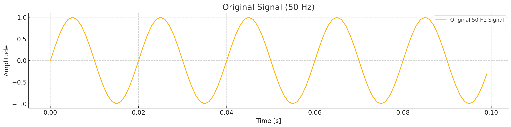
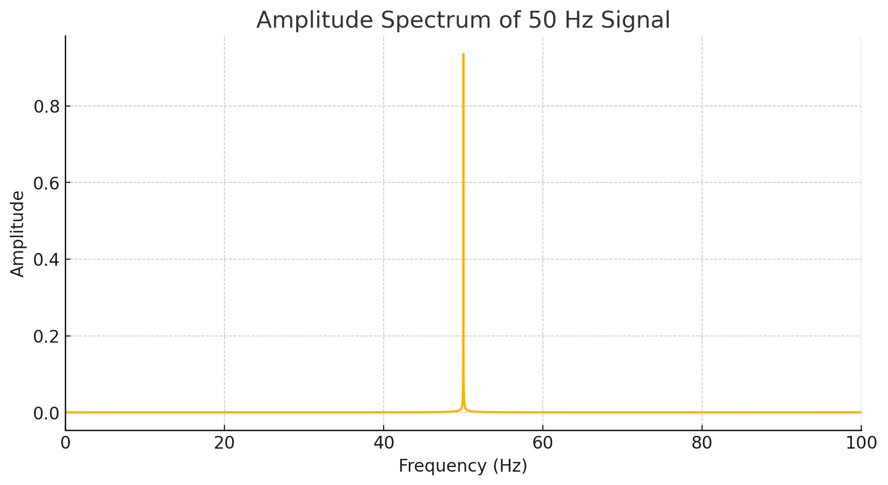
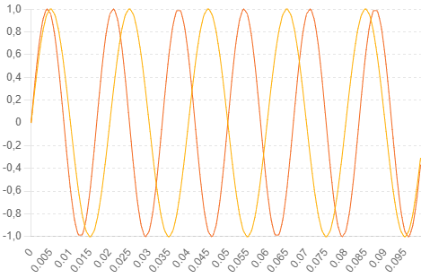
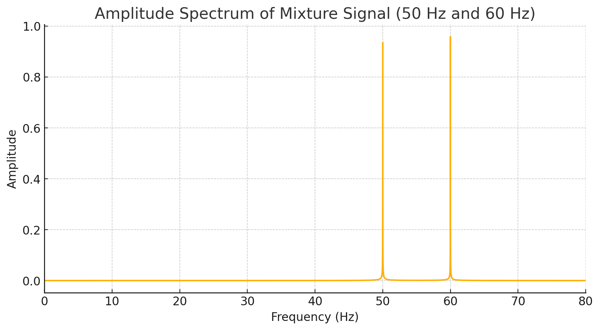
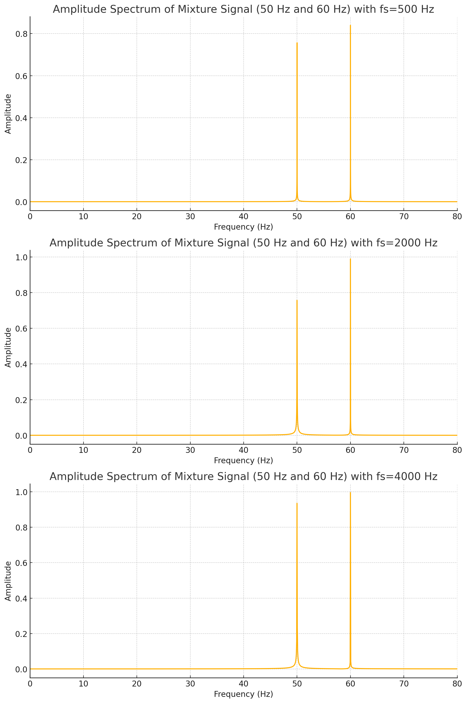
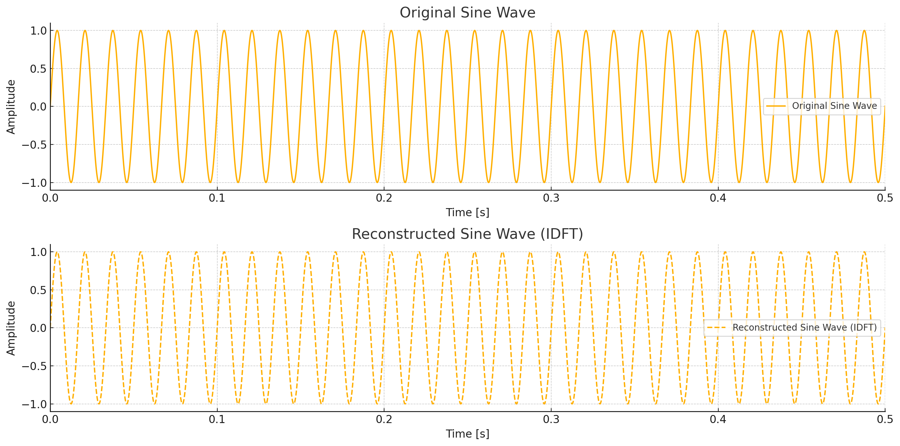

# Ćwiczenie 2

---

## Analiza sygnałów okresowych w dziedzinie częstotliwości

---

Celem ćwiczenia jest praktyczne wypróbowanie funkcji numpy.fft
i numpy.ifft do wyznaczania prostej i odwrotnej transformaty Fouriera [1, 3].

**1. Wygeneruj ciąg próbek odpowiadający fali sinusoidalnej o częstotliwości 50 Hz
i długości 65536.**

---

**2. Wyznacz dyskretną transformatę Fouriera tego sygnału i przedstaw jego widmo
amplitudowe na wykresie w zakresie częstotliwości [0, fs/2], gdzie fs oznacza
częstotliwość próbkowania.**

---

**3. Wygeneruj ciąg próbek mieszaniny dwóch fal sinusoidalnych (tzn. ich kombinacji
liniowej) o częstotliwościach 50 i 60 Hz. Wykonaj zadanie z punktu 2 dla tego
sygnału.**

---

**4. Powtórz eksperymenty dla różnych czasów trwania sygnałów, tzn. dla różnych
częstotliwości próbkowania.**

Wykresy przedstawiają widmo amplitudowe sygnału będącego mieszaniną dwóch częstotliwości: 50 Hz i 60 Hz,
dla różnych częstotliwości próbkowania (fs). 

Widmo amplitudowe dla fs = 500 Hz pokazuje dwa wyraźne 
piki przy 50 Hz i 60 Hz, co odpowiada częstotliwościom składowym sygnału. Amplituda dla obu 
częstotliwości wynosi około 0,8 dla 50 Hz i 1,0 dla 60 Hz. 

W przypadku fs = 2000 Hz, podobnie 
jak wcześniej, widoczne są dwa piki przy 50 Hz i 60 Hz, z amplitudami rzędu 0,8 dla 50 Hz i 1,0 
dla 60 Hz. Dla fs = 4000 Hz, piki przy 50 Hz i 60 Hz są wyraźne i dobrze zdefiniowane, a amplitudy 
są podobne do poprzednich przypadków, wynosząc około 0,8 dla 50 Hz i 1,0 dla 60 Hz. 

We wszystkich przypadkach widmo amplitudowe dokładnie przedstawia częstotliwości składowe sygnału,
niezależnie od częstotliwości próbkowania. Przy wyższych częstotliwościach próbkowania wykresy są
bardziej szczegółowe, co może być korzystne dla dokładnej analizy sygnałów. Wykresy pokazują, że
sygnał zawiera dwie składowe harmoniczne o częstotliwościach 50 Hz i 60 Hz.

---

**5. Wyznacz odwrotne transformaty Fouriera ciągów wyznaczonych w zadaniu 2
i porównaj z ciągami oryginalnymi.**

Powyższe ykresy przedstawiają porównanie między oryginalnym sygnałem sinusoidalnym a sygnałem zrekonstruowanym
za pomocą odwrotnej dyskretnej transformaty Fouriera (IDFT). Oryginalny sygnał ma częstotliwość 60 Hz,
a jego amplituda oscyluje płynnie między -1 a 1. Wykres pokazuje okresowy przebieg fali, który jest
jednolity na przestrzeni 0,5 sekundy. 

Zrekonstruowany sygnał został odtworzony po zastosowaniu IDFT na oryginalnym sygnale. Jego amplituda 
i kształt fali są prawie identyczne z oryginalnym sygnałem, co dowodzi, że transformacja i jej
odwrotność zostały wykonane poprawnie. Linia przerywana na wykresie zrekonstruowanego sygnału wskazuje,
że jest to wynik IDFT, ale jego przebieg i wartości są praktycznie takie same jak w oryginale. 

W skrócie, wykresy pokazują, że zarówno oryginalny, jak i zrekonstruowany sygnał mają tę samą
strukturę, co potwierdza dokładność przeprowadzonych operacji transformacji i odwrotnej transformacji
Fouriera.