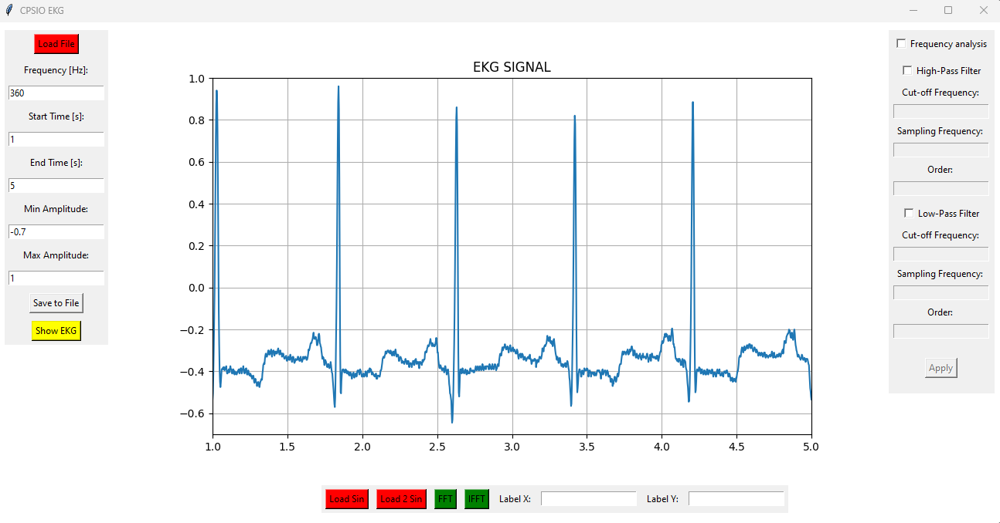
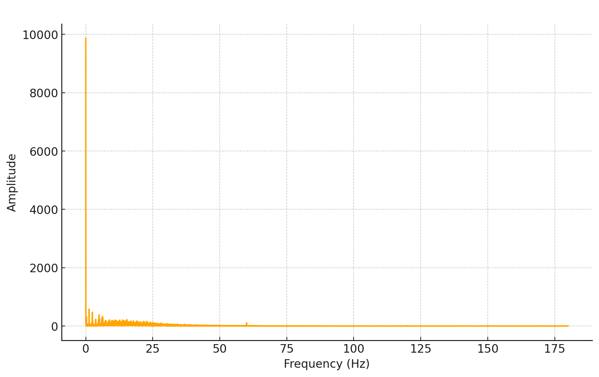
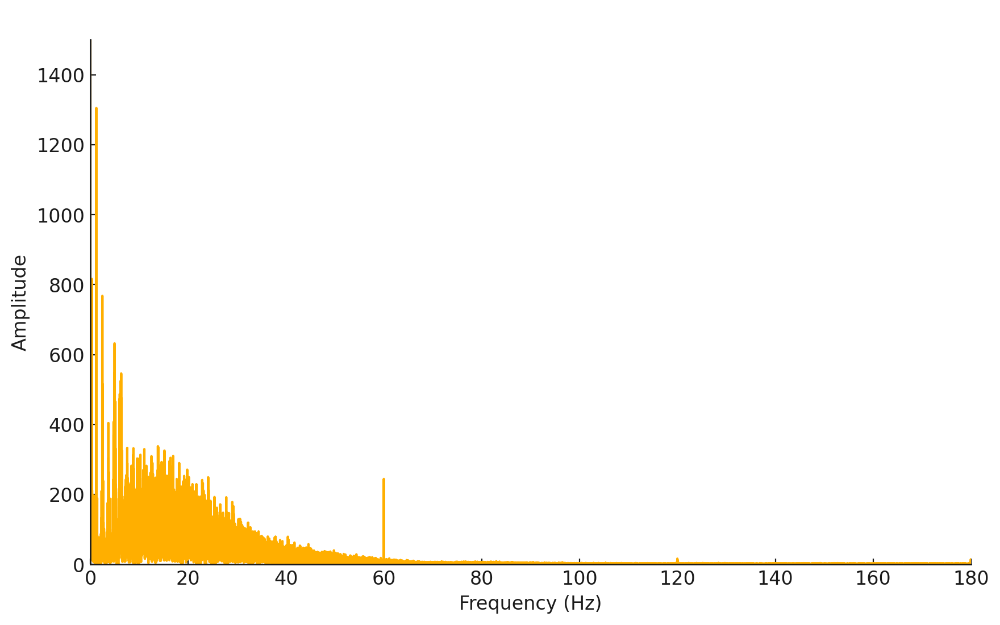

# Ćwiczenie 3

---

Analiza sygnału EKG w dziedzinie częstotliwości

---

Celem ćwiczenia jest obserwacja widma sygnału EKG.

1) Wczytać sygnał ekg100.txt i ocenić go wizualnie na wykresie

Na załączonym wykresie EKG widać dane sygnałowe, które zostały załadowane do aplikacji. 
Oś X reprezentuje czas w sekundach, od 1 do 5 sekund, natomiast oś Y przedstawia 
amplitudę sygnału EKG, z zakresem od -0.7 do 1. Skala jest odpowiednio dobrana, 
umożliwiając wyraźną obserwację charakterystyki sygnału.

Sygnał EKG jest wyraźny, z dobrze widocznymi załamkami QRS, co jest kluczowe dla 
analizy rytmu serca. Amplituda załamków jest znacznie większa niż innych części 
sygnału, co jest typowe dla tego typu sygnałów. W sygnale nie widać znaczących szumów 
ani artefaktów, co sugeruje, że dane są dobrze przefiltrowane lub pochodzą z czystego źródła.

Wykres EKG wydaje się być poprawny, z wyraźnymi załamkami QRS i minimalnymi szumami. 
Częstotliwość próbkowania i zakres czasowy są odpowiednie, a parametry wykresu 
dobrze dobrane do wizualnej analizy sygnału EKG. 

2) Wyznaczyć jego dyskretną transformatę Fouriera i przedstawić widmo amplitudowe 
sygnału w funkcji częstotliwości w zakresie [0, fs/2], gdzie fs oznacza
częstotliwość próbkowania.

Powyższy wykres przedstawia transformację Fouriera sygnału EKG, 
co pozwala na analizę częstotliwościową tego sygnału. Wykres pokazuje, że większość 
energii sygnału EKG jest skoncentrowana w niskich częstotliwościach, co jest typowe 
dla sygnałów serca bijącego z relatywnie niską częstotliwością. Widoczny jest bardzo 
wysoki pik na niskich częstotliwościach, a pozostałe częstotliwości mają znacznie 
mniejsze amplitudy, co oznacza, że sygnał EKG ma niewielką ilość energii w wyższych 
częstotliwościach.

Zakres wykresu sięga do 200 Hz, ale wszystkie istotne komponenty sygnału są 
skoncentrowane poniżej około 50 Hz, co jest zgodne z typowym EKG, które ma główne 
komponenty częstotliwościowe w przedziale 0-50 Hz. 

Transformacja Fouriera jest 
narzędziem umożliwiającym analizę widmową sygnału, co pozwala na identyfikację i 
analizę różnych częstotliwości w sygnale. W kontekście EKG, analiza widmowa może 
pomóc w identyfikacji anomalii, takich jak arytmie, które mogą mieć specyficzne 
cechy częstotliwościowe.

---

Powyższy wykres przedstawia widmo amplitudowe sygnału EKG, gdzie oś pozioma pokazuje
częstotliwości w hercach (Hz), a oś pionowa reprezentuje amplitudy. 

Na wykresie wyraźnie widoczny jest pik przy częstotliwości 60 Hz, 
co sugeruje zakłócenia sieciowe wynikające z zasilania elektrycznego, które w 
wielu krajach wynosi 50 lub 60 Hz. Ponadto, amplituda sygnału maleje wraz ze 
wzrostem częstotliwości, co jest typowe dla sygnałów biologicznych, które mają 
tendencję do posiadania większości energii w niższych pasmach częstotliwości.

---

3) Wyznaczyć odwrotną dyskretną transformatę Fouriera ciągu wyznaczonego w
punkcie 2 i porównać otrzymany ciąg próbek z pierwotnym sygnałem ecg100
(można wyznaczyć różnicę sygnałów)