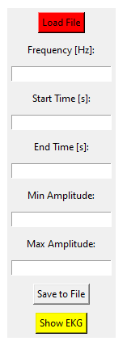
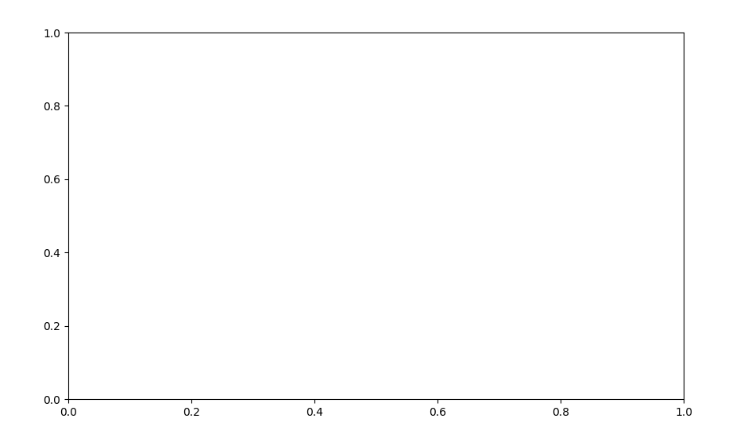
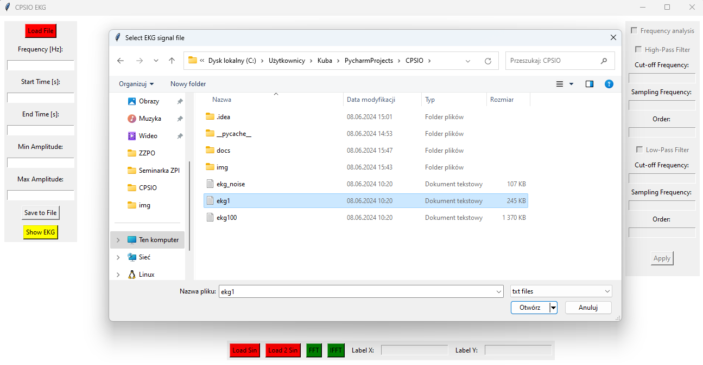

# Ćwiczenie 1

Napisz skrypt w Pythonie/Matlabie umożliwiający wczytywanie i wizualizację badanych sygnałów.
Program powinien umożliwiać obserwowanie wycinka
sygnału dla zadanego przedziału czasowego, skalowanie osi wykresów i ich opis oraz
zapis dowolnego wycinka sygnału do pliku o podanej nazwie.
Sygnały EKG mają format plików tekstowych, w których wiersze odpowiadają kolejnym próbkom, 
a kolumny kanałom pomiarowym (odprowadzeniom EKG).
W niektórych plikach pierwsza kolumna zawiera momenty czasu, a druga zawiera
wartości próbek sygnału EKG. W takim przypadku pierwsza kolumna służy do skalowania osi 
czasu.

Kolejne ćwiczenia będą polegały na stopniowym rozbudowywaniu platformy testowej o 
nowe funkcjonalności. Sprawozdanie powinno obejmować wszystkie ćwiczenia z przetwarzania sygnałów EKG. Do sprawozdania należy dołączyć kod. Przy
okazji tworzenia sprawozdania warto rozważyć nauczenie się i wykorzystanie notatnika 
jupyter [2]. Można też przygotować raport w tradycyjny sposób.

---

## Platofrma testowa

Na zdjęciu znajduje się interfejs graficzny aplikacji, która służy do analizy i
przetwarzania sygnałów elektrokardiograficznych (EKG). Aplikacja posiada kilka paneli 
z przyciskami i polami tekstowymi umożliwiającymi użytkownikowi różne operacje na danych. 

### Wygląd i Funkcjonalność Aplikacji

---

#### Panel Lewy
- **Load File (Czerwony przycisk)**: Umożliwia użytkownikowi załadowanie pliku z danymi EKG z dysku. Kliknięcie tego przycisku otwiera okno dialogowe wyboru pliku.
- **Frequency [Hz]**: Pole tekstowe, w którym użytkownik może wprowadzić częstotliwość próbkowania danych EKG. Jest to istotne dla późniejszej analizy sygnału.
- **Start Time [s]**: Pole tekstowe do wprowadzenia czasu początkowego analizy. Umożliwia użytkownikowi określenie, od którego momentu sygnał EKG ma być analizowany.
- **End Time [s]**: Pole tekstowe do wprowadzenia czasu końcowego analizy. Umożliwia użytkownikowi określenie, do którego momentu sygnał EKG ma być analizowany.
- **Min Amplitude**: Pole tekstowe do wprowadzenia minimalnej amplitudy sygnału. Może być używane do filtrowania sygnału lub ustawiania zakresu wyświetlania.
- **Max Amplitude**: Pole tekstowe do wprowadzenia maksymalnej amplitudy sygnału. Podobnie jak minimalna amplituda, służy do filtrowania lub ustawiania zakresu wyświetlania.
- **Save to File (Szary przycisk)**: Umożliwia zapisanie przetworzonych danych do pliku. Po kliknięciu otwiera okno dialogowe, gdzie użytkownik może wybrać lokalizację i nazwę pliku.
- **Show EKG (Żółty przycisk)**: Po kliknięciu tego przycisku, załadowany sygnał EKG jest wyświetlany na wykresie w centralnej części interfejsu. Przycisk ten inicjuje proces rysowania wykresu z danymi EKG.

---

#### Panel Środkowy
- **Wykres**: Obszar, gdzie wyświetlane są dane EKG. Początkowo jest pusty, ale po załadowaniu i przetworzeniu danych, sygnał EKG jest wizualizowany w tym miejscu.

---

#### Panel Prawy
- **Frequency analysis (Pole wyboru)**: Pozwala użytkownikowi włączyć lub wyłączyć analizę częstotliwościową sygnału EKG.
- **High-Pass Filter (Pole wyboru)**: Umożliwia użytkownikowi włączenie filtra górnoprzepustowego. Po zaznaczeniu, pojawiają się dodatkowe pola do wprowadzenia parametrów filtra:
  - **Cut-off Frequency**: Pole tekstowe do wprowadzenia częstotliwości odcięcia filtra.
  - **Sampling Frequency**: Pole tekstowe do wprowadzenia częstotliwości próbkowania.
  - **Order**: Pole tekstowe do wprowadzenia rzędu filtra.
- **Low-Pass Filter (Pole wyboru)**: Umożliwia użytkownikowi włączenie filtra dolnoprzepustowego. Po zaznaczeniu, pojawiają się dodatkowe pola do wprowadzenia parametrów filtra:
  - **Cut-off Frequency**: Pole tekstowe do wprowadzenia częstotliwości odcięcia filtra.
  - **Sampling Frequency**: Pole tekstowe do wprowadzenia częstotliwości próbkowania.
  - **Order**: Pole tekstowe do wprowadzenia rzędu filtra.
- **Apply (Szary przycisk)**: Po ustawieniu odpowiednich parametrów filtra, kliknięcie tego przycisku stosuje wybrane filtry do załadowanego sygnału EKG.

---

#### Panel Dolny
- **Load Sin (Czerwony przycisk)**: Umożliwia załadowanie sygnału sinusoidalnego do testowania i porównywania z sygnałem EKG.
- **Load 2 Sin (Czerwony przycisk)**: Umożliwia załadowanie dwóch sygnałów sinusoidalnych do bardziej złożonych testów.
- **FFT (Zielony przycisk)**: Przycisk do wykonania szybkiej transformaty Fouriera (FFT) na załadowanym sygnale, co pozwala na analizę częstotliwościową sygnału.
- **IFFT (Zielony przycisk)**: Przycisk do wykonania odwrotnej szybkiej transformaty Fouriera (IFFT), co pozwala na odtworzenie oryginalnego sygnału z jego reprezentacji częstotliwościowej.
- **Label X**: Pole tekstowe do wprowadzenia etykiety osi X wykresu.
- **Label Y**: Pole tekstowe do wprowadzenia etykiety osi Y wykresu.

---

### Jak Działa Aplikacja
1) **Ładowanie Danych**: Użytkownik rozpoczyna od załadowania 
pliku z danymi EKG za pomocą przycisku "Load File". 

2) **Konfiguracja Analizy**: Następnie może wprowadzić odpowiednie 
parametry takie jak częstotliwość próbkowania, czas początkowy i 
końcowy analizy, oraz amplitudy minimalne i maksymalne.

3) **Wyświetlenie Sygnału**: Po wprowadzeniu parametrów i 
załadowaniu danych, użytkownik klika "Show EKG" aby 
wyświetlić sygnał na wykresie.

4) **Przetwarzanie Sygnału**: Użytkownik może zastosować różne filtry 
(górnoprzepustowy, dolnoprzepustowy) poprzez zaznaczenie 
odpowiednich opcji i wprowadzenie parametrów. Kliknięcie 
"Apply" stosuje te filtry do sygnału.

5) **Analiza Częstotliwościowa**: Opcje FFT i IFFT umożliwiają 
użytkownikowi wykonanie analizy częstotliwościowej sygnału EKG 
oraz odtworzenie sygnału z tej analizy.

Ponadto aplikacja umożliwia wygenerowanie fali sinusoidalnej oraz 
sumy dwóch takich fal.

6) **Zapis Danych**: Po przetworzeniu i analizie, użytkownik może zapisać wyniki do pliku za pomocą przycisku "Save to File".

Aplikacja oferuje intuicyjny interfejs użytkownika, umożliwiający kompleksową analizę sygnałów EKG, co jest przydatne zarówno w badaniach naukowych, jak i w praktyce klinicznej.
