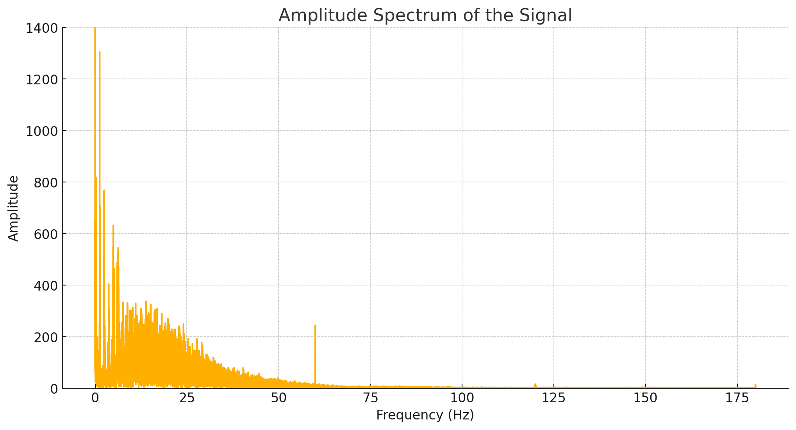
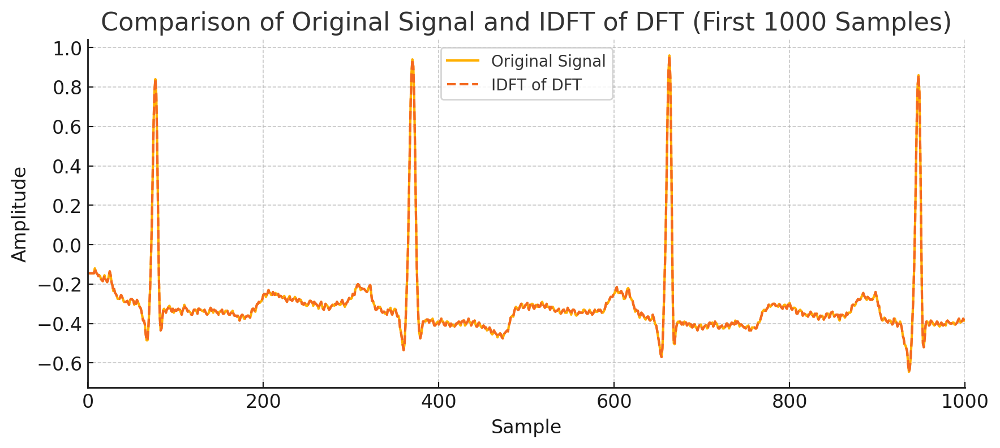

# Ćwiczenie 3

---

Analiza sygnału EKG w dziedzinie częstotliwości

---

Celem ćwiczenia jest obserwacja widma sygnału EKG.

**1) Wczytać sygnał ekg100.txt i ocenić go wizualnie na wykresie**

Na załączonym wykresie EKG widać dane sygnałowe, które zostały załadowane do aplikacji. 
Oś X reprezentuje czas w sekundach, od 1 do 5 sekund, natomiast oś Y przedstawia 
amplitudę sygnału EKG, z zakresem od -0.7 do 1. Skala jest odpowiednio dobrana, 
umożliwiając wyraźną obserwację charakterystyki sygnału.

Sygnał EKG jest wyraźny, z dobrze widocznymi załamkami QRS, co jest kluczowe dla 
analizy rytmu serca. Amplituda załamków jest znacznie większa niż innych części 
sygnału, co jest typowe dla tego typu sygnałów. W sygnale nie widać znaczących szumów 
ani artefaktów, co sugeruje, że dane są dobrze przefiltrowane lub pochodzą z czystego źródła.

Wykres EKG wydaje się być poprawny, z wyraźnymi załamkami QRS i minimalnymi szumami. 
Częstotliwość próbkowania i zakres czasowy są odpowiednie, a parametry wykresu 
dobrze dobrane do wizualnej analizy sygnału EKG. 

**2) Wyznaczyć jego dyskretną transformatę Fouriera i przedstawić widmo amplitudowe 
sygnału w funkcji częstotliwości w zakresie [0, fs/2], gdzie fs oznacza
częstotliwość próbkowania.**

---

Powyższy wykres przedstawia widmo amplitudowe sygnału EKG, gdzie oś pozioma pokazuje
częstotliwości w hercach (Hz), a oś pionowa reprezentuje amplitudy.
Widmo amplitudowe sygnału EKG przedstawia rozkład częstotliwościowy sygnału, czyli pokazuje, 
jakie składowe częstotliwościowe są obecne w sygnale i z jaką amplitudą. 

Na wykresie widzimy, 
że największe amplitudy znajdują się w niskich częstotliwościach (poniżej 20 Hz). Jest to 
zgodne z charakterystyką sygnału EKG, ponieważ większość energii sygnału EKG skupiona jest 
w przedziale od 0.05 Hz do 40 Hz. Najważniejsze składowe, takie jak załamki P, QRS, i T, 
mają największą energię w tych częstotliwościach. 

W okolicach 0 Hz widzimy bardzo wysoki pik, 
co może wskazywać na obecność składowej stałej w sygnale. Jest to normalne w przypadku sygnałów 
EKG, ponieważ mogą zawierać pewne przesunięcie DC (składowa stała), które nie niesie użytecznej 
informacji diagnostycznej, ale jest efektem nieidealnego sprzętu pomiarowego lub innych źródeł 
zakłóceń. 

Amplituda składowych częstotliwościowych powyżej 50 Hz jest znacznie mniejsza, co 
również jest typowe dla sygnałów EKG. W rzeczywistości sygnały EKG są zwykle filtrowane w 
celu usunięcia składowych o częstotliwościach powyżej 50-60 Hz, które mogą być wynikiem 
zakłóceń elektromagnetycznych (np. z sieci elektrycznej). 

Widoczne są pojedyncze piki w okolicach 
60 Hz, co może być wynikiem interferencji sieci elektrycznej. Jest to częsty problem w 
nagraniach EKG i często stosuje się filtry do eliminacji tych zakłóceń.

---

**3) Wyznaczyć odwrotną dyskretną transformatę Fouriera ciągu wyznaczonego w
punkcie 2 i porównać otrzymany ciąg próbek z pierwotnym sygnałem ekg100
(można wyznaczyć różnicę sygnałów)**

Po zastosowaniu odwrotnej transformaty Fouriera (IDFT) do sygnału EKG, otrzymany sygnał jest bardzo 
zbliżony do oryginalnego. Główne cechy sygnału, takie jak piki i doliny, które odpowiadają zespołom 
QRS, falom P i T w typowym sygnale EKG, są dobrze zachowane. To oznacza, że transformata Fouriera 
i jej odwrotność skutecznie zachowują krytyczne elementy sygnału EKG niezbędne do diagnostyki.

Linia bazowa w sygnale zrekonstruowanym jest zgodna z oryginalnym sygnałem, 
bez znaczących przesunięć. Amplituda pików w zrekonstruowanym sygnale jest również zgodna z 
oryginałem, co oznacza, że intensywność sygnału została zachowana.

Komponenty wysokiej częstotliwości zostały dobrze zachowane, co jest kluczowe dla uchwycenia 
szybkich zmian w sygnale, takich jak strome wzrosty i spadki zespołu QRS.

Wykres różnicy między oryginalnym sygnałem EKG a odwrotną transformatą Fouriera (IDFT) sygnału 
dostarcza istotnych informacji w kontekście analizy EKG. Po pierwsze, dokładność rekonstrukcji: 
w idealnym przypadku różnica powinna wynosić zero, co oznacza, że IDFT doskonale odwzorowuje 
oryginalny sygnał. W praktyce mogą występować niewielkie różnice z powodu błędów numerycznych 
i obcięcia wyższych częstotliwości. Znaczne odchylenia mogą wskazywać na obecność szumów lub 
artefaktów, które nie zostały idealnie odwzorowane. Niski poziom różnic sugeruje, że sygnał 
jest stosunkowo czysty i procesy transformacji Fouriera dokładnie odwzorowują sygnał.

Transformata Fouriera działa również jako filtr, potencjalnie wygładzając pewne szumy, 
jednocześnie redukując komponenty o wysokiej częstotliwości. Wykres różnicy może pokazywać
efekt netto tego filtrowania. Jeśli pewne szumy o wysokiej częstotliwości są redukowane, 
może to być korzystne dla wyraźniejszej interpretacji sygnału.